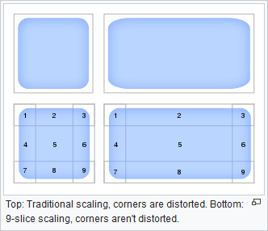

# filter-9slice

## Introduction

A small simple plugin that provides a "9-slice" (a.k.a. 9-slicing, 9-patch, or Scale 9 grid) filter for [OBS](https://obsproject.com).

## Preview

https://user-images.githubusercontent.com/602691/212372141-2f828531-9272-4459-87a0-514e6d49fbce.mp4

*A scaled-up 48 pixel square image where the 9-slice filter is turned on and off.*

## What is 9-slice?

9-slice scaling is a 2D image resizing technique that attempts to keep the edges of an image proportional as the size changes.

Check [the Wikipedia page](https://en.wikipedia.org/wiki/9-slice_scaling) for more information.

(*Image [CC BY-SA 4.0](https://commons.wikimedia.org/wiki/File:Traditional_scaling_vs_9-slice_scaling.svg)*)
